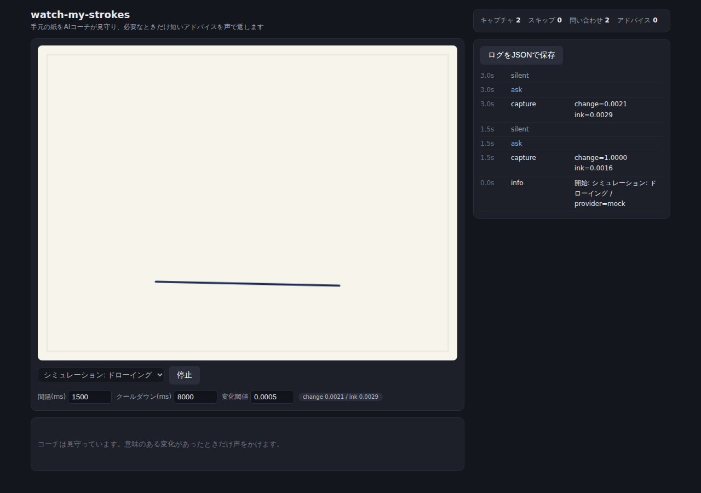
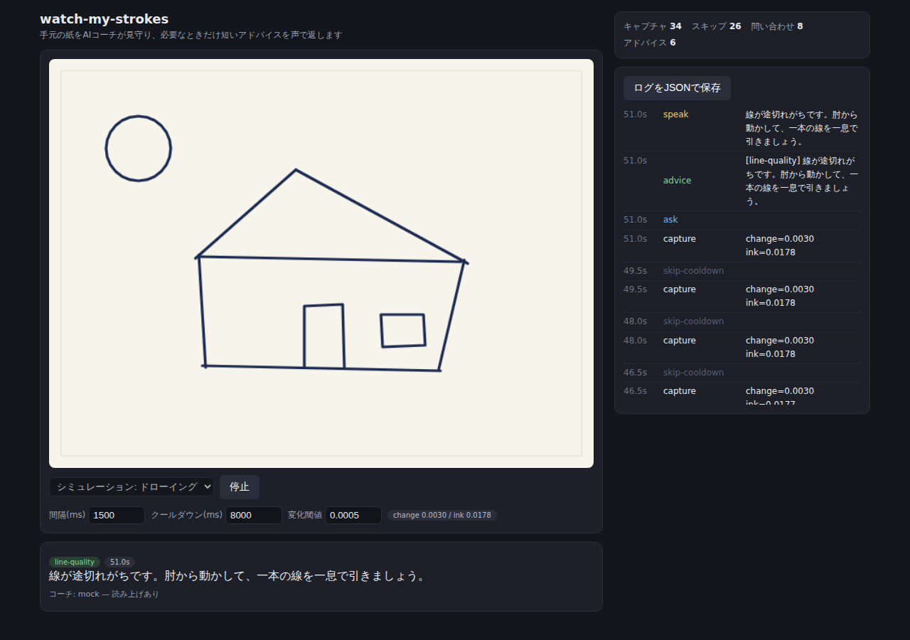
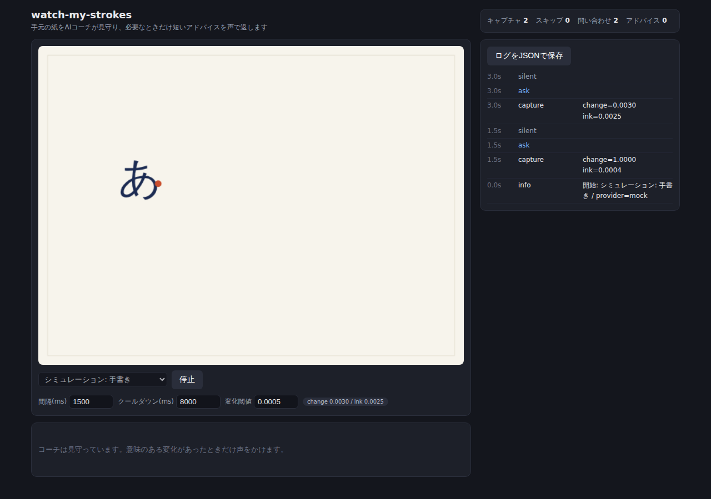
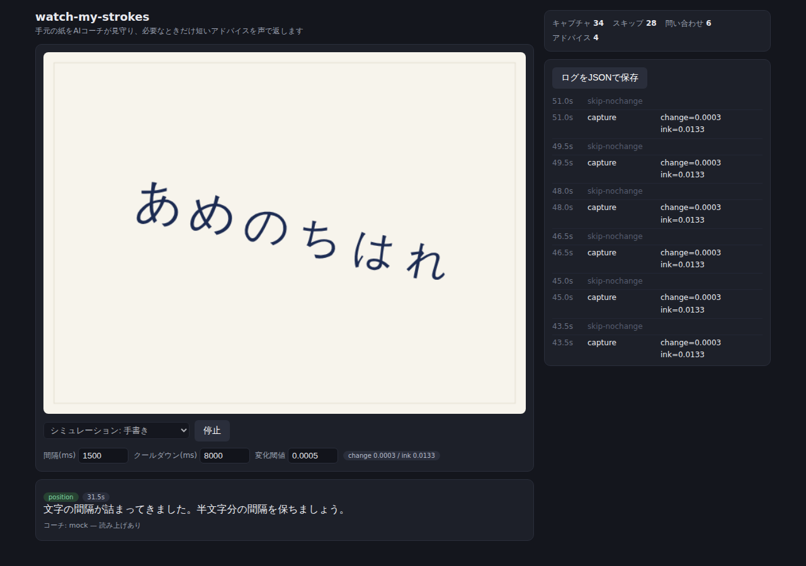

# E2Eシミュレーション結果

`bun run simulate` により自動生成。ヘッドレスChromium上でシミュレーション映像ソース
(徐々に描き進む合成映像)を再生し、モックコーチとの全ループを検証した。

パイプライン: 映像 → 1.5秒毎キャプチャ → 変化検知(足切り) → クールダウン →
コーチ問い合わせ → 介入判断 → 発話イベント(TTS)

## シナリオ: drawing

 

| 指標 | 値 |
|---|---|
| キャプチャ | 34 |
| 送信スキップ(変化なし) | 3 |
| 送信スキップ(クールダウン) | 23 |
| 送信スキップ(問い合わせ中) | 0 |
| コーチ問い合わせ | 8 |
| 介入(アドバイス) | 6 |
| 沈黙判断 | 2 |
| 発話イベント | 6 |
| エラー | 0 |

### コーチの発話タイムライン

| 時刻 | アドバイス |
|---|---|
| 6.0s | [proportions] 細部より先に、全体のアタリを薄い線で取りましょう。紙の中央に大きく。 |
| 15.0s | [position] 全体が右に寄っています。次の線から中心を少し左に意識しましょう。 |
| 24.0s | [position] 水平の基準線に対して傾いています。紙を回さず、手首の角度を直しましょう。 |
| 33.0s | [position] 全体が右に寄っています。次の線から中心を少し左に意識しましょう。 |
| 42.0s | [position] 水平の基準線に対して傾いています。紙を回さず、手首の角度を直しましょう。 |
| 51.0s | [line-quality] 線が途切れがちです。肘から動かして、一本の線を一息で引きましょう。 |

## シナリオ: handwriting

 

| 指標 | 値 |
|---|---|
| キャプチャ | 34 |
| 送信スキップ(変化なし) | 18 |
| 送信スキップ(クールダウン) | 10 |
| 送信スキップ(問い合わせ中) | 0 |
| コーチ問い合わせ | 6 |
| 介入(アドバイス) | 4 |
| 沈黙判断 | 2 |
| 発話イベント | 4 |
| エラー | 0 |

### コーチの発話タイムライン

| 時刻 | アドバイス |
|---|---|
| 4.5s | [proportions] 文字の大きさを揃えることを最優先に。1行目と同じ高さを意識しましょう。 |
| 13.5s | [proportions] まず字の外形(四角の枠)をイメージしてから書き始めましょう。 |
| 22.5s | [position] 行がだんだん右下がりになっています。ガイド線を意識して水平に戻しましょう。 |
| 31.5s | [position] 文字の間隔が詰まってきました。半文字分の間隔を保ちましょう。 |

## 検証ポイント

- 変化のないフレームは `skip-nochange` としてAPI到達前に足切りされている
- 発話直後は `skip-cooldown` により問い合わせ自体が止まっている
- 問い合わせても `silent`(介入なし)になるケースがあり、「言うことがなければ黙る」が機能している
- 介入は一度に1メッセージで、`speak` イベントとして記録されている
